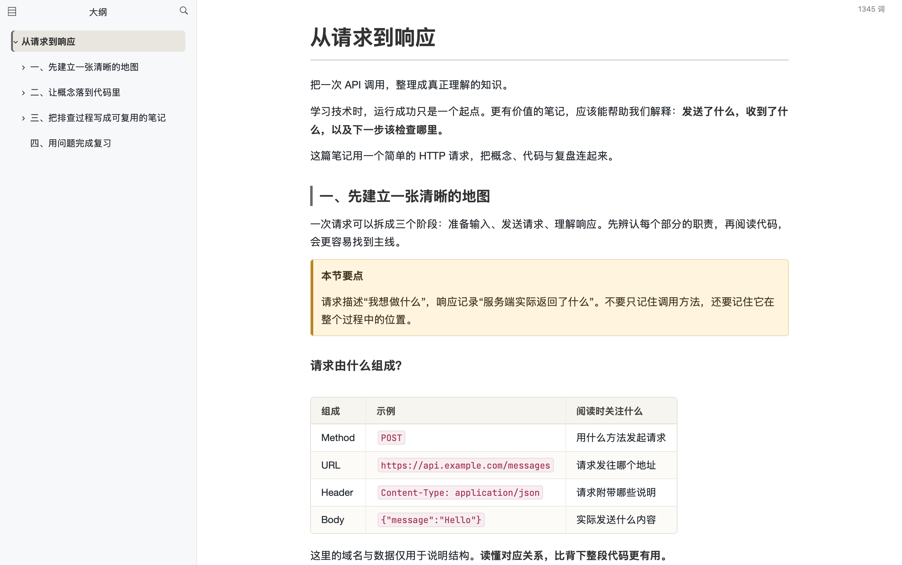
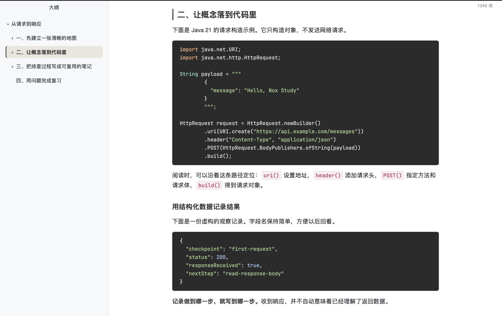

# Nox Study

这是一个浅色的 Typora 主题，主要用来写笔记、读笔记。

最初是为了让自己长时间看学习笔记时更舒服一点，陆续调整了正文宽度、标题、表格和代码块。现在索性整理出来，分享给有同样需求的人。

正文、大纲、引用和表格的实际效果：




## 样式

- 白色背景，深灰正文，阅读区域不会铺满整个窗口。
- 标题层级清楚，方便配合左侧大纲查看长笔记。
- 表格采用暖灰配色，引用和高亮用少量暖色点缀。
- 代码块采用炭灰背景，内置 JetBrains Mono 字体。


## 代码预览




## 使用教程

### 下载 ZIP

[下载源码 ZIP](https://github.com/AlgorithGeek/nox-study/archive/refs/heads/main.zip) 并解压。只想快速安装使用的话，选这个方式就好。

### 通过 Git 获取

如果想通过 Git 获取后续更新，长久使用最新版，可以克隆仓库：

HTTPS（无需配置 SSH 密钥）：

```bash
git clone https://github.com/AlgorithGeek/nox-study.git
```

SSH（需要先在 GitHub 配置自己的 SSH 密钥）：

```bash
git clone git@github.com:AlgorithGeek/nox-study.git
```

之后在克隆的 `nox-study` 目录中执行 `git pull` 获取更新，再将主题文件重新复制到 Typora 的主题文件夹。

### 安装主题

两种方式获取的文件都按下面的步骤安装：

1. 在 Typora 的「设置 / 偏好设置 → 外观」中打开主题文件夹。
2. 将项目中的 `nox-study.css` 和 `nox-study/` 文件夹一起复制进去。
3. 重启 Typora，在主题菜单中选择 **Nox Study**。

字体随主题附带，无需单独安装。`examples/` 文件夹不用复制到主题目录。

安装后，可以打开示例笔记 [从请求到响应](examples/从请求到响应.md)，看看实际效果。


## 使用说明

**长代码**：关闭 Typora 的代码块自动换行后，超出宽度的代码可以横向滚动；短代码不会显示横向滚动条。PDF 导出样式会对长代码换行。

**高亮**：如需使用 `==高亮内容==`，请在 Typora 中启用对应的 Markdown 扩展。

**自定义**：字体、字号、行距和颜色主要在 `nox-study.css` 开头的 `:root` 中，正文宽度在 `#write` 规则中。修改后重新切换主题，或重启 Typora 查看效果。

目前在 macOS / Typora 1.14.10 中使用。Windows、Linux，以及完整 PDF 分页和 HTML 离线字体效果尚未验证。

遇到显示问题，可以在 [Issues](https://github.com/AlgorithGeek/nox-study/issues) 中附上截图、操作系统和 Typora 版本。


## 许可

主题代码使用 [MIT License](LICENSE)，保留原有版权声明。

附带的 JetBrains Mono 2.242 字体使用 [SIL Open Font License 1.1](nox-study/OFL.txt)。字体的版本、官方来源和校验值见 [字体来源记录](nox-study/FONT-SOURCES.md)。分发时请保留相应版权声明和许可证。
